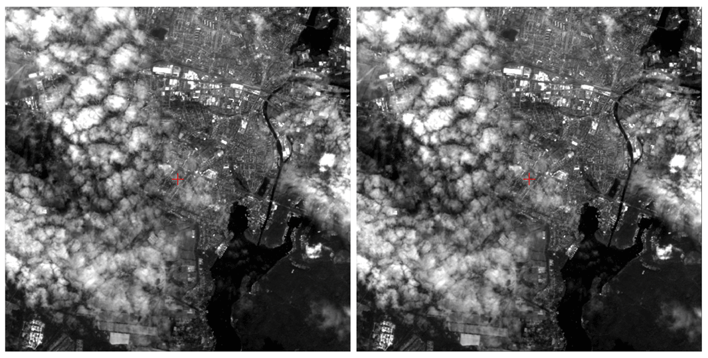
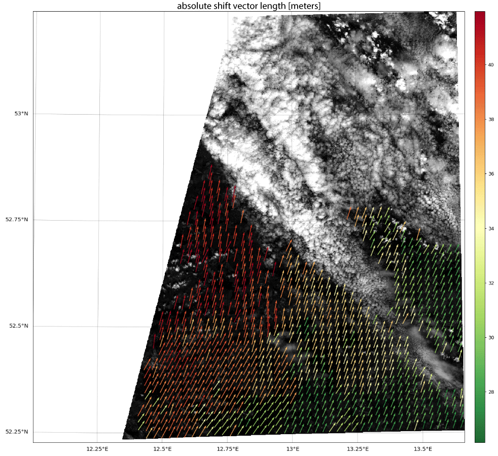

.. figure:: http://danschef.gitext.gfz-potsdam.de/arosics/images/arosics_logo.png
        :target: https://gitext.gfz-potsdam.de/danschef/arosics

An Automated and Robust Open-Source Image Co-Registration Software for Multi-Sensor Satellite Data

* Free software: GNU General Public License v3
* Documentation: http://danschef.gitext.gfz-potsdam.de/arosics/doc/

Status
------

.. .. image:: https://img.shields.io/travis/danschef/arosics.svg
        :target: https://travis-ci.org/danschef/arosics

.. .. image:: https://readthedocs.org/projects/arosics/badge/?version=latest
        :target: https://arosics.readthedocs.io/en/latest/?badge=latest
        :alt: Documentation Status

.. .. image:: https://pyup.io/repos/github/danschef/arosics/shield.svg
     :target: https://pyup.io/repos/github/danschef/arosics/
     :alt: Updates

.. image:: https://gitext.gfz-potsdam.de/danschef/arosics/badges/master/build.svg
        :target: https://gitext.gfz-potsdam.de/danschef/arosics/commits/master
.. image:: https://gitext.gfz-potsdam.de/danschef/arosics/badges/master/coverage.svg
        :target: http://danschef.gitext.gfz-potsdam.de/arosics/coverage/
.. image:: https://img.shields.io/pypi/v/arosics.svg
        :target: https://pypi.python.org/pypi/arosics
.. image:: https://img.shields.io/pypi/l/arosics.svg
        :target: https://gitext.gfz-potsdam.de/danschef/arosics/blob/master/LICENSE
.. image:: https://img.shields.io/pypi/pyversions/arosics.svg
        :target: https://img.shields.io/pypi/pyversions/arosics.svg

See also the latest coverage_ report and the nosetests_ HTML report.
Detection and correction of local or global geometric displacements between two input images:

Feature overview
----------------

AROSICS is a python package to perform automatic subpixel co-registration of two satellite image datasets
based on an image matching approach working in the frequency domain, combined with a multistage workflow for
effective detection of false-positives.

It detects and corrects local as well as global misregistrations between two input images in the subpixel scale,
that are often present in satellite imagery. The algorithm is robust against the typical difficulties of
multi-sensoral/multi-temporal images. It supports a wide range of input data formats and can be used from the command
line (without any Python experience) or as a normal Python package.

**Global co-registration - fast but only for static X/Y-shifts:**

Only a global X/Y translation is computed within a small subset of the input images (window position is adjustable).
This allows very fast co-registration but only corrects for translational (global) X/Y shifts.
The calculated subpixel-shifts are (by default) applied to the geocoding information of the output image.
No spatial resampling is done automatically as long as both input images have the same projection. However, AROSICS
also allows to align the output image to the reference image coordinate grid if needed.

Here is an example of a Landsat-8 / Sentinel-2 image pair before and after co-registration using AROSICS:

**Local co-registration - for spatially variable shifts but a bit slower**:

A dense grid of tie points is automatically computed, whereas tie points are subsequently validated using a
multistage workflow. Only those tie points not marked as false-positives are used to compute the parameters of an
affine transformation. Warping of the target image is done using an appropriate resampling technique
(cubic by default).

Here is an example of the computed shift vectors after filtering false-positives
(mainly due to clouds in the target image):

For further details check out the `documentation <http://danschef.gitext.gfz-potsdam.de/arosics/doc/>`!

Credits
-------

AROSICS was developed by Daniel Scheffler (German Research Centre of Geosciences) within the context of the
`GeoMultiSens project <http://www.geomultisens.de/>`__ funded by the German Federal Ministry of Education and Research
(project grant code: 01 IS 14 010 A-C).

This package was created with Cookiecutter_ and the `audreyr/cookiecutter-pypackage`_ project template.
The test data represent modified Copernicus Sentinel-2 data (ESA 2016). The input data for the figures in the
documentation have been provided by NASA (Landsat-8) and ESA (Sentinel-2).

.. _Cookiecutter: https://github.com/audreyr/cookiecutter
.. _`audreyr/cookiecutter-pypackage`: https://github.com/audreyr/cookiecutter-pypackage
.. _coverage: http://danschef.gitext.gfz-potsdam.de/arosics/coverage/
.. _nosetests: http://danschef.gitext.gfz-potsdam.de/arosics/nosetests_reports/nosetests.html
.. _conda: https://conda.io/docs/

