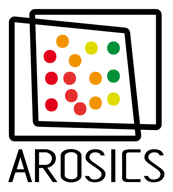
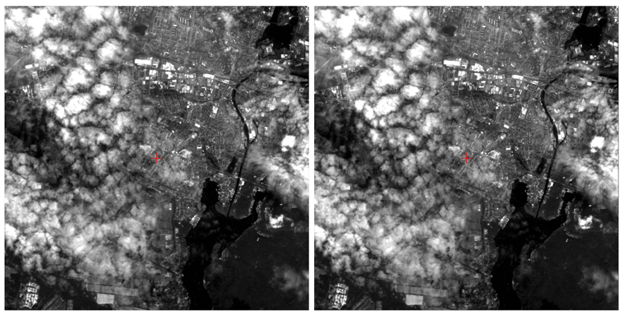
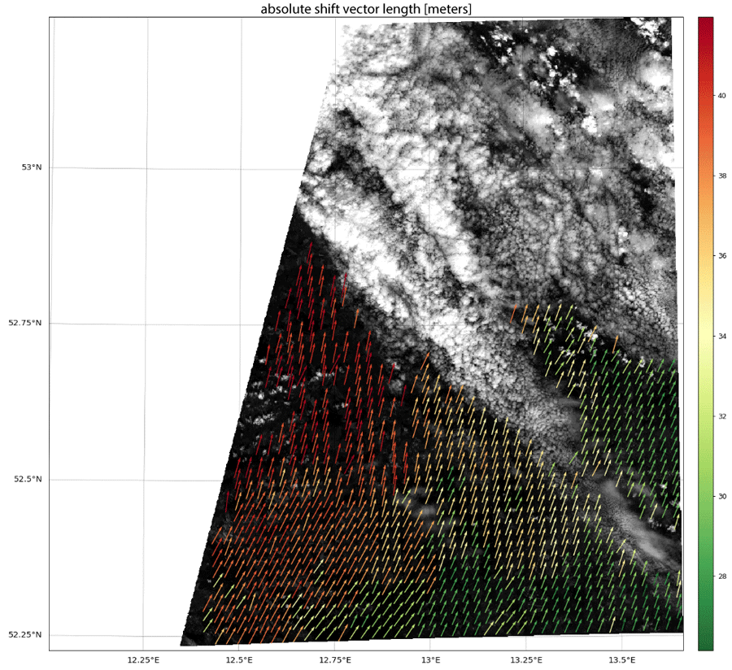

=====
About
=====

Perform automatic subpixel co-registration of two satellite image datasets based on an image matching approach working
in the frequency domain, combined with a multistage workflow for effective detection of false-positives. Python
implementation by Daniel Scheffler (daniel.scheffler [at] gfz-potsdam [dot] de).

AROSICS detects and corrects local as well as global misregistrations between two input images in the subpixel scale,
that are often present in satellite imagery. It is designed to robustly handle the typical difficulties of
multi-sensoral/multi-temporal images. Clouds are automatically handled by the implemented outlier detection algorithms.
The user may provide user-defined masks to exclude certain image areas from tie point creation. The image overlap area
is automatically calculated.

For detailed algorithm description and use cases refer to the corresponding (open-access) paper that can be found here:
`Scheffler D, Hollstein A, Diedrich H, Segl K, Hostert P. AROSICS: An Automated and Robust Open-Source Image
Co-Registration Software for Multi-Sensor Satellite Data. Remote Sensing. 2017; 9(7):676
<https://www.mdpi.com/2072-4292/9/7/676>`__.

* GitLab Repository: https://git.gfz-potsdam.de/danschef/arosics/
* Documentation: https://danschef.git-pages.gfz-potsdam.de/arosics/doc/

Feature overview
----------------

Global co-registration - fast but only for static X/Y-shifts
~~~~~~~~~~~~~~~~~~~~~~~~~~~~~~~~~~~~~~~~~~~~~~~~~~~~~~~~~~~~

Only a global X/Y translation is computed within a small subset of the input images (window position is adjustable).
This allows very fast co-registration but only corrects for translational (global) X/Y shifts.
The calculated subpixel-shifts are (by default) applied to the geocoding information of the output image.
No spatial resampling is done automatically as long as both input images have the same projection. However, AROSICS
also allows to align the output image to the reference image coordinate grid if needed.

Here is an example of a Landsat-8 / Sentinel-2 image pair before and after co-registration using AROSICS:

Local co-registration - for spatially variable shifts but a bit slower
~~~~~~~~~~~~~~~~~~~~~~~~~~~~~~~~~~~~~~~~~~~~~~~~~~~~~~~~~~~~~~~~~~~~~~

A dense grid of tie points is automatically computed, whereas tie points are subsequently validated using a
multistage workflow. Only those tie points not marked as false-positives are used to compute the parameters of an
affine transformation. Warping of the target image is done using an appropriate resampling technique
(cubic by default).

Here is an example of the computed shift vectors after filtering false-positives
(mainly due to clouds in the target image):

