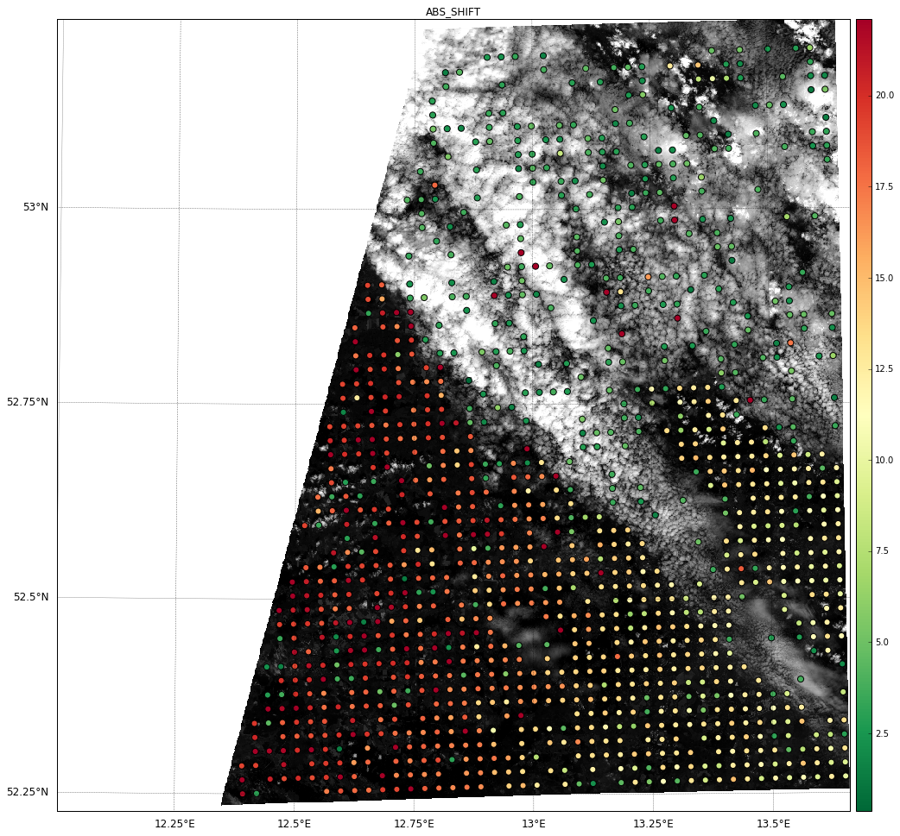
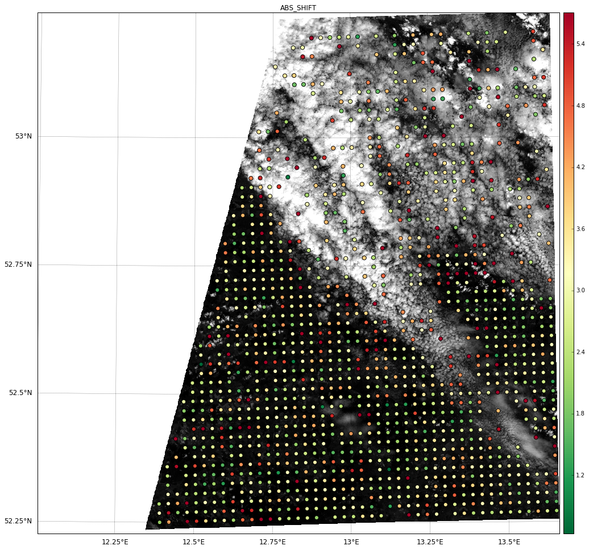
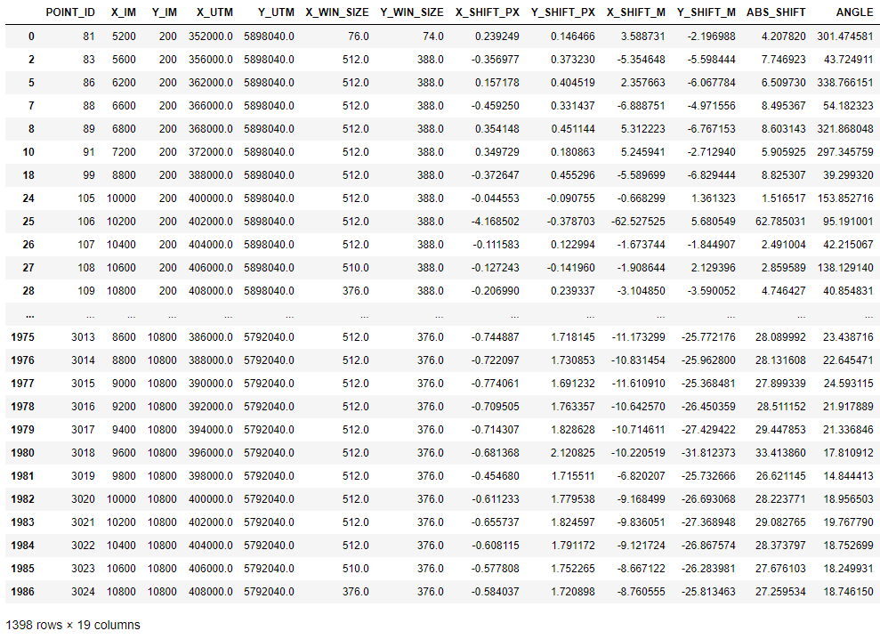

Local image co-registration
***************************

This local co-registration module of AROSICS has been designed to detect and correct geometric shifts present locally
in your input image. The class :class:`arosics.COREG_LOCAL` calculates a grid of spatial shifts with points spread
over the whole overlap area of the input images. Based on this grid a correction of local shifts can be performed.

Using the Python API
--------------------

detect and correct local shifts - with input data on disk
~~~~~~~~~~~~~~~~~~~~~~~~~~~~~~~~~~~~~~~~~~~~~~~~~~~~~~~~~

.. code-block:: python

    >>> from arosics import COREG_LOCAL

    >>> im_reference = '/path/to/your/ref_image.bsq'
    >>> im_target    = '/path/to/your/tgt_image.bsq'
    >>> kwargs = {
    >>>     'grid_res'     : 200,
    >>>     'window_size'  : (64,64),
    >>>     'path_out'     : 'auto',
    >>>     'projectDir'   : 'my_project',
    >>>     'q'            : False,
    >>> }

    >>> CRL = COREG_LOCAL(im_reference,im_target,**kwargs)
    >>> CRL.correct_shifts()

    Calculating actual data corner coordinates for reference image...
    Corner coordinates of reference image:
        [[319090.0, 5790510.0], [351800.0, 5899940.0], [409790.0, 5900040.0], [409790.0, 5790250.0], [319090.0, 5790250.0]]
    Calculating actual data corner coordinates for image to be shifted...
    Corner coordinates of image to be shifted:
        [[319460.0, 5790510.0], [352270.0, 5900040.0], [409790.0, 5900040.0], [409790.0, 5790250.0], [319460.0, 5790250.0]]
    Matching window position (X,Y): 372220.10753674706/5841066.947109019
    Calculating tie point grid (1977 points) in mode 'multiprocessing'...
        progress: |==================================================| 100.0% [1977/1977] Complete 9.75 sek
    Found 1144 valid GCPs.
    Correcting geometric shifts...
    Translating progress |==================================================| 100.0% Complete
    Warping progress     |==================================================| 100.0% Complete
    Writing GeoArray of size (10979, 10979) to /home/gfz-fe/scheffler/jupyter/arosics_jupyter/my_project/S2A_OPER_MSI_L1C_TL_SGS__20160608T153121_A005024_T33UUU_B03__shifted_to__S2A_OPER_MSI_L1C_TL_SGS__20160529T153631_A004881_T33UUU_B03.bsq.

    OrderedDict([('band', None),
                 ('is shifted', True),
                 ('is resampled', True),
                 ('updated map info',
                  ['UTM',
                   1,
                   1,
                   300000.0,
                   5900030.0,
                   10.0,
                   10.0,
                   33,
                   'North',
                   'WGS-84']),
                 ('updated geotransform',
                  [300000.0, 10.0, 0.0, 5900030.0, 0.0, -10.0]),
                 ('updated projection',
                  'PROJCS["WGS 84 / UTM zone 33N",GEOGCS["WGS 84",DATUM["WGS_1984",SPHEROID["WGS 84",6378137,298.257223563,AUTHORITY["EPSG","7030"]],AUTHORITY["EPSG","6326"]],PRIMEM["Greenwich",0,AUTHORITY["EPSG","8901"]],UNIT["degree",0.0174532925199433,AUTHORITY["EPSG","9122"]],AXIS["Latitude",NORTH],AXIS["Longitude",EAST],AUTHORITY["EPSG","4326"]],PROJECTION["Transverse_Mercator"],PARAMETER["latitude_of_origin",0],PARAMETER["central_meridian",15],PARAMETER["scale_factor",0.9996],PARAMETER["false_easting",500000],PARAMETER["false_northing",0],UNIT["metre",1,AUTHORITY["EPSG","9001"]],AXIS["Easting",EAST],AXIS["Northing",NORTH],AUTHORITY["EPSG","32633"]]'),
                 ('arr_shifted', array([[   0,    0,    0, ..., 1034,  996, 1001],
                         [   0,    0,    0, ..., 1046, 1114, 1124],
                         [   0,    0,    0, ..., 1021, 1126, 1148],
                         ...,
                         [   0,    0,    0, ...,  760,  769,  805],
                         [   0,    0,    0, ...,  762,  755,  765],
                         [   0,    0,    0, ...,    0,    0,    0]], dtype=uint16)),
                 ('GeoArray_shifted',
                  <geoarray.GeoArray at 0x7f451ac14a90>)])

detect and correct local shifts - without any disk access
~~~~~~~~~~~~~~~~~~~~~~~~~~~~~~~~~~~~~~~~~~~~~~~~~~~~~~~~~

All you have to do is to instanciate :class:`arosics.COREG_LOCAL` with two instances of the :class:`geoarray.GeoArray`
class as described above.

.. code-block:: python

    >>> from geoarray import GeoArray

    >>> CRL = COREG_LOCAL(GeoArray(ref_ndarray, ref_gt, ref_prj),
    >>>                   GeoArray(tgt_ndarray, tgt_gt, tgt_prj),
    >>>                   **kwargs)
    >>> CRL.correct_shifts()

visualize tie point grid with INITIAL shifts present in your input target image
~~~~~~~~~~~~~~~~~~~~~~~~~~~~~~~~~~~~~~~~~~~~~~~~~~~~~~~~~~~~~~~~~~~~~~~~~~~~~~~

Use the method :meth:`CRL.view_CoRegPoints()<arosics.COREG_LOCAL.view_CoRegPoints>` to visualize the tie point grid with
the calculated absolute lenghts of the shift vectors (the unit corresponds to the input projection - UTM in the shown
example, thus the unit is 'meters'.).

.. note::

    A calculation of reliable shifts above cloud covered areas is not possible.
    In the current version of AROSICS these areas are not masked. A proper masking is planned.

.. code-block:: python

    >>> CRL.view_CoRegPoints(figsize=(15,15), backgroundIm='ref')

    Note: array has been downsampled to 1000 x 1000 for faster visualization.

The output figure shows the calculated absolute lenghts of the shift vectors - in this case with shifts up to ~25 meters.

visualize tie point grid with shifts present AFTER shift correction
~~~~~~~~~~~~~~~~~~~~~~~~~~~~~~~~~~~~~~~~~~~~~~~~~~~~~~~~~~~~~~~~~~~

The remaining shifts after local correction can be calculated and visualized by instanciating the
:class:`arosics.COREG_LOCAL` with the output path of the above instance of :class:`COREG_LOCAL<arosics.COREG_LOCAL>`.

.. code-block:: python

    >>> CRL_after_corr = COREG_LOCAL(im_reference, CRL.path_out, **kwargs)
    >>> CRL_after_corr.view_CoRegPoints(figsize=(15,15),backgroundIm='ref')

    Calculating actual data corner coordinates for reference image...
    Corner coordinates of reference image:
        [[319090.0, 5790510.0], [351800.0, 5899940.0], [409790.0, 5900040.0], [409790.0, 5790250.0], [319090.0, 5790250.0]]
    Calculating actual data corner coordinates for image to be shifted...
    Corner coordinates of image to be shifted:
        [[319460.0, 5790540.0], [352270.0, 5900030.0], [409780.0, 5900030.0], [409780.0, 5790260.0], [322970.0, 5790250.0], [319460.0, 5790280.0]]
    Matching window position (X,Y): 372216.38593955856/5841068.390957352
    Note: array has been downsampled to 1000 x 1000 for faster visualization.
    Calculating tie point grid (1977 points) in mode 'multiprocessing'...
        progress: |==================================================| 100.0% [1977/1977] Complete 10.78 sek

The output figure shows a significant reduction of geometric shifts.

show the points table of the calculated tie point grid
~~~~~~~~~~~~~~~~~~~~~~~~~~~~~~~~~~~~~~~~~~~~~~~~~~~~~~

.. note::

    Point records where no valid match has been found are filled with -9999.

.. code-block:: python

    >>> CRL.CoRegPoints_table

export tie point grid to an ESRI point shapefile
~~~~~~~~~~~~~~~~~~~~~~~~~~~~~~~~~~~~~~~~~~~~~~~~

.. code-block:: python

    >>> CRL.tiepoint_grid.to_PointShapefile(path_out='/path/to/your/output_shapefile.shp')

----

Using the Shell console
-----------------------

Follow these instructions to run AROSICS from a shell console. For example, the most simple call for a local
co-registration would look like this:

.. code-block:: bash

    $ arosics local /path/to/your/ref_image.bsq /path/to/your/tgt_image.bsq 50
